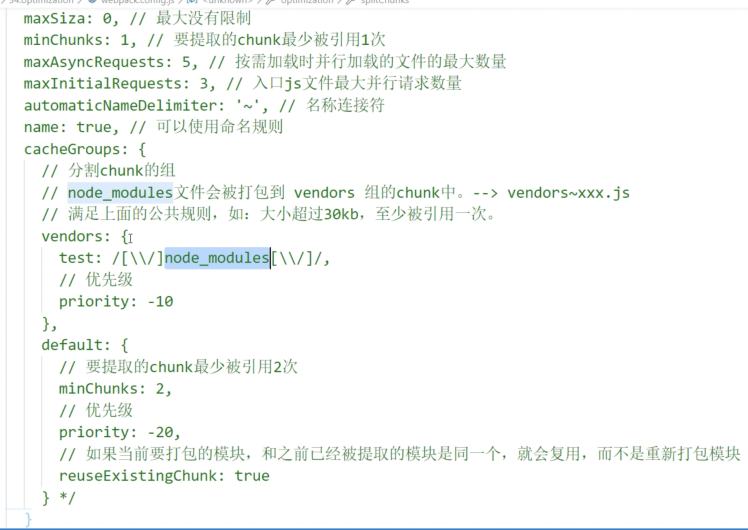

[entry](#entry)

[output](#output)

[module](#module)

[resolve](#resolve)

[devServer](#devServer)

[optimization](#optimization)

#### entry

```js
1. './src/index.js'
	单入口，形成一个 chunk 文件，输出一个 bundle 文件
	chunk 名称默认为 main

2. ['./src/index.js', './src/some.js']
	多入口，形成一个 chunk 文件，输出一个 bundle 文件，some.js 会被打包进 index.js
	应用：HMR 使得 html 热更新生效

3. { index: './src/index.js', some: './src/some.js' }
	多入口，有几个入口文件，就形成几个 chunk 和 bundle，[name] 为 key

4. { react: ['react', 'react-dom', 'react-router'], index: './src/index.js' }
	形成两个 chunk 两个 bundle，react 相关的都打包在一块
```

#### output

```js
  output: {
    // 文件路径+文件名
    filename: 'js/[name].[contenthash:8].js',
    // 输出文件目录，将来所有资源输出的公共目录
    path: resolve(__dirname, 'build'),
    // 所有资源的公共路径前缀，通常用在生产环境，'/' 指的是根目录，
    // eg：若静态资源存放在服务器根目录的public目录下，则配置 '/public', 若发到cdn上，则配置cdn
    publicPath: '/public',
    // 非入口chunk的名字，两种可能：import 动态引入的；配置 optimization.splitChunks.chunks = 'all' 打包 node_modules 的chunk
    chunkFilename: 'js/[name]_chunk.js',
    // 整个库向外暴露的变量名，一般用作公共库才配置这个，通常配合 dll 使用
    library: '[name]',
    // 向外暴露的变量添加到哪里，可以选择 window ｜ global ｜ commonjs ｜ amd ...
    libraryTarget: 'window',
  },
```

#### module

```js
module: {
    rules: [
      {
        test: /\.css$/,
        // 多个loader
        use: [
          'style-loader',
          'css-loader',
          { loader: 'post-css', options: {} },
        ],
      },
      {
        test: /\.js$/,
        // 单个loader
        loader: 'eslint-loader',
        // 优先执行，post 为延后执行
        enforce: 'pre',
        exclude: /node_modules/,
        include: resolve(__dirname, 'src'),
        // 个性化配置
        options: {},
      },
    ],
  },
```

#### resolve

```js
  // 解析模块规则
  resolve: {
    // 路径别名
    alias: {
      '@': resolve(__dirname, 'src'),
    },
    // 省略文件的后缀名
    extensions: ['.js', 'json', '.jsx', '.tsx', '.ts'],
    // 告诉webpack解析模块去找那个目录
    modules: [__dirname + 'node_modules', 'node_modules'],
  },
```

#### devServer

```js
devServer: {
    // 项目构建后路径
    contentBase: resolve(__dirname, 'build'),
    // 监视 contentBase 下的文件，一旦有变化就 reload
    watchContentBase: true,
    watchOptions: {
      ignored: /node_modules/,
    },
    // 开启gzip压缩
    compress: true,
    host: 'localhost',
    port: 3333,
    // 自动打开浏览器
    open: true,
    // 开启 HMR
    hot: true,
    // 不显示启动服务器的日志信息（控制台不打印）
    clientLogLevel: false,
    // 除了一些基本的信息，其他的内容都不显示(控制台不打印)
    quiet: true,
    // 如果出错了，不全屏显示
    overlay: false,
    // 开发代理，解决开发环境跨域问题
    proxy: {
      '/api': {
        target: 'http://localhost:8888',
        // 重写请求路径，'/api/xxx' -> '/xxx'
        pathRewrite: {
          '^/api': '',
        },
      },
    },
  },
```

#### optimization

```js
optimization: {
	splitChunks: {
  	chunks: 'all'
    ...
    // 下面的默认配置如下面图片上所示，可以不写
    // 图截的不全，上面还有个 minSize: 30 * 1024 , 分割的chunk最小为30kb
  },
   // 解决场景：index.js 文件引入了 a.js 和 b.js, a.js 改变了会导致 index.js contenthash 改变，导致 index.js 的缓存失效
   // 下面的配置，可以单独为改变的模块(这里指的是 a.js)单独生成一个 runtime 文件
   runtimeChunk: {
     name: (entryPoint) => `runtime-${entryPoint.name}`,
   },
   // 配置生产环境的压缩方案：js 和 css，有默认的配置，可以在这里自定义配置
   minimizer: [
     // webpack 4.26.x 以上，使用 terser-webpack-plugin 压缩 js
     // 要修改默认的配置，需要安装 npm i terser-webpack-plugin -D
     new TerserWebpackPlugin({
       // 开启缓存
       cache: true,
       // 开启多进程打包
       parallel: true,
       // 开启 source-map
       sourceMap: true,
     }),
    ],
}
```

`示例`

