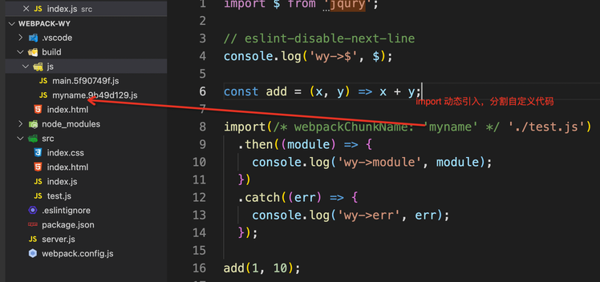
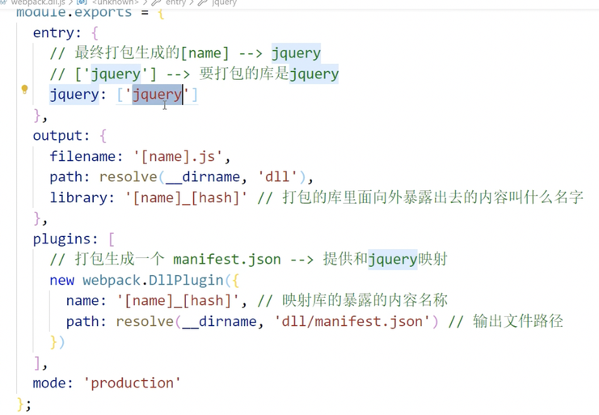
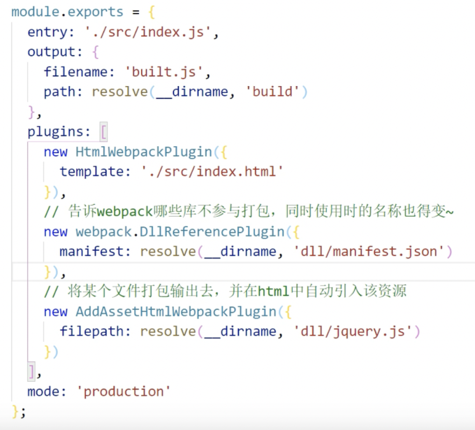

## webpack 常用配置介绍

### 快速导航

[基础配置](#基础配置)

[eslint](#eslint-配置)

[HMR](#HMR)

[js/html 压缩](#js-压缩--html-压缩)

[生产环境部分配置详解 MR](#生产环境部分配置详解)

[webpack 性能优化](#webpack-性能优化)

[sourcemap](#sourcemap)

[oneOf](#oneOf)

[缓存](#缓存)

[treeshaking](#tree-shaking)

[codesplit](#code-split)

[懒加载/预加载](#懒加载--预加载)

[多进程打包](#多进程打包)

[externals](#externals)

[dll](#dll)

[package.json](#packagejson)

[更多详细](#更多详细)

### 基础配置

```js
const { resolve } = require('path');
const HtmlWebpackPlugin = require('html-webpack-plugin');

module.exports = {
  mode: 'development',
  entry: './src/index.js',
  // 绝对路径
  output: {
    // 对应主入口的输出文件名
    filename: 'js/[name].[hash:8].bundle.js',
    // 文件输出路径
    path: resolve(__dirname, 'build'),
  },
  // loader
  module: {
    rules: [
      {
        test: /\.css$/,
        use: [
          // 创建style标签，将样式插入
          'style-loader',
          // 将css文件转成commonjs文件加载到js中，内容是字符串
          'css-loader',
        ],
      },
      {
        test: /\.less$/,
        use: ['style-loader', 'css-loader', 'less-loader'],
      },
      {
        // url-loader 的问题：处理样式中的图片，无法处理html中的img路径
        test: /\.(png|jpe?g|gif|webp)$/i,
        // 需要下载 url-load 和 file-loader ， url-loader 依赖 file-load
        // ⚠️：只使用一个loader时候，用loader: 'xxx', use: [{loader: 'xxx'}] 或者 use: ['xxx']
        loader: 'url-loader',
        options: {
          // 20k 以下的，转成 base64
          limit: 20 * 1024,
          // 问题：url-loader 默认使用 es6 模块化，而 html-loader 引入图片使用 commonjs
          // 解决：关闭url-loader的es6模块化，使用 commonjs 解析
          esModule: false,
          // 重命名
          name: '[hash:8].[ext]',
          outputPath: 'imgs',
        },
      },
      {
        // html-loader 不是打包html，而是对html中img的相对路径进行处理，配合 url-loader 使用
        // html-loader 负责引入 img，从而能被 url-loader 处理
        test: /\.html$/,
        loader: 'html-loader',
      },
      {
        // 其他静态资源，复制
        // exclude 排除这些文件
        exclude: /\.(css|html|js|less|sass|jpe?g|gif|png|webp)$/,
        loader: 'file-loader',
        options: {
          name: '[hash:10].[ext]',
          outputPath: 'public',
        },
      },
    ],
  },
  // 插件
  plugins: [
    // 默认创建一个空的html，自动引入打包输出的所有资源(css/js)
    new HtmlWebpackPlugin({
      // 配置自定义的html模板
      template: './src/index.html',
    }),
  ],

  // 开发服务器，需要安装 webpack-dev-server，不会产生任何输出，只在内存中编译打包
  // 启动指令：npx webpack-dev-server
  devServer: {
    // 项目构建后路径
    contentBase: resolve(__dirname, 'build'),
    // 开启gzip压缩
    compress: true,
    port: 3333,
    // 自动打开浏览器
    open: true,
    // 启动热更新
    // 默认只对 css 的热更新有作用（style-loader 处理），要想支持 js 热更新，需要在入口文件处监听 module.hot， 下面有详细说明
    hot: true,
  },
};
```

### eslint 配置

```js
...
module: {
    rules: [
      /*
        语法检查 eslint eslint-loader
        设置检查规则：
          package.json 中的 eslintConfig 设置或者 .eslintrc.js 设置
          "eslintConfig": {
            "extends": "aribnb-base",
            "env": {
            	"browser": true, // 指明环境为浏览器
            }
          }

          要使用 airbnb , 需要安装 eslint eslint-config-airbnb-base eslint-plugin-import
      */
      {
        test: /\.js$/,
        exclude: /node_modules/,
        loader: 'eslint-loader',
        options: {
          fix: true,
        },
      },
    ],
  },
...
```

### js 兼容性处理

```js
...
module: {
  rules: [
    /*
      js 兼容性处理
        1.基本兼容性处理：@babel/preset-env ，
          问题：只能处理基础的语法(箭头函数)， promise 没法转
        2.全部的兼容性处理：@babel/polyfill 不需要配置，直接在入口文件处引入就行
          问题：所有的兼容性代码都引入了，体积太大了～
        3.按需加载，core-js, 需要进行额外的配置

        @babel/polyfill 和 core-js 只能二选一
    */
    {
      test: /\.js$/,
      loader: 'babel-loader',
      options: {
        presets: [
          [
            '@babel/preset-env',
            {
              // 按需加载
              useBuiltIns: 'usage',
              // 指定 core-js 版本
              corejs: {
                version: '3',
              },
              // 指定兼容性做到那个版本的浏览器
              targets: {
                chrome: '60',
                firefox: '60',
                safari: '34',
                ie: '9',
                edge: '17',
              },
            },
            ],
        ],
      },
    },
  ],
},
...
```

### js 压缩 & html 压缩

```js
...
// 通过指定 mode 为 production 即可自动开启 js 压缩
plugins: [
	new HtmlWebpackPlugin({
  	template: './src/index.html',
    // 压缩 html
    minify: {
    	// 移除空格
      collapseWhitespace: true,
      // 移除注释
      removeComments: true
    }
  })
],
...
```

### 生产环境部分配置详解

```js
// mimi-css-extract-plugin 将css抽出成单独的文件
// optimize-css-assets-webpack-plugin 压缩css
const { resolve } = require('path');
const HtmlWebpackPlugin = require('html-webpack-plugin');
const MiniCssExtractPlugin = require('mini-css-extract-plugin');
const OptimizeCssAssetsWebpackPlugin = require('optimize-css-assets-webpack-plugin');

process.env.NODE_ENV = 'development';

module.exports = {
  mode: 'development',
  entry: './src/index.js',
  output: {
    filename: 'js/bundle.[hash:8].js',
    path: resolve(__dirname, 'build'),
  },
  module: {
    rules: [
      {
        test: /\.css$/,
        use: [
          // MiniCssExtractPlugin.loader 替代 style-loader
          // style-loader 用于将js里面的css抽离，并以style标签的形式插入html
          // MiniCssExtractPlugin.loader 用于将js里面的css抽离成单独的文件
          MiniCssExtractPlugin.loader,
          // 将css打包进js里面
          'css-loader',
          // css 兼容性处理，postcss --> 需要安装 postcss-loader & postcss-preset-env
          /* 
            postcss-preset-env 帮助 postcss 找到 package.json 里面的 browserslist 配置，根据这个配置加载制定的css兼容样式

            "browserslist": {
              // 要指定 postcss 的开发环境，需要设置node环境变量，process.env.NODE_ENV = 'development'
              "development": [
                "last 1 chrome version",
                "last 1 firefox version",
                "last 1 safari version"
              ],
              // postcss 处理默认是生产环境，与配置的 mode 无关
              "production": [
                ">0.2%",
                "not dead",
                "not op_mini all"
              ]
            }
          */
          {
            // 下面的插件使用不生效。。我去，可能是 webpack 版本不兼容的问题
            loader: 'postcss-loader',
            // options: {
            //   // 固定写法
            //   ident: 'postcss',
            //   plugins: [require('postcss-preset-env')()],
            // },
          },
        ],
      },
      {
        test: /\.less$/,
        use: [MiniCssExtractPlugin.loader, 'css-loader', 'less-loader'],
      },
    ],
  },
  plugins: [
    new HtmlWebpackPlugin({
      template: './src/index.html',
    }),
    // 将css抽离成单独的文件，需要将 style-loader 更换为 MiniCssExtractPlugin.loader
    new MiniCssExtractPlugin({
      // 对输出的css文件进行重命名
      filename: 'css/[name].[hash:8].css',
    }),
    // 压缩css
    new OptimizeCssAssetsWebpackPlugin(),
  ],
};
```

### 

### webpack 性能优化

**开发环境性能优化**

- 优化打包构建速度
- 优化开发调试

**生产环境性能优化**

- 优化打包构建速度
- 优化代码的运行性能

#### HMR

```Plain Text
HMR: Hot Module Replace 模块热替换
作用：一个模块发生改变，只重新打包这一个模块，而不是打包所有模块，提升构建速度

css: 可以使用HMR，style-loader 内部实现了
js: 默认不能使用HMR，只能处理非入口的热更新
	解决：入口文件处监听文件变化执行回调
		if (module.hot) {
        module.hot.accept('./print', () => {
          // ./print 发生变化，其他模块不会重新打包构建
          print();
        });
      }
html:  不能使用HMR，html 热更新，需要修改 entry为 ['./src/index.js', './src/index.html']
```

```js
// ./src/index.js

// js 热更新
if (module.hot) {
  module.hot.accept('./xxxModule', () => {
    // ./print 发生变化，其他模块不会重新打包构建
    print();
  });
}
```

#### sourcemap

```Plain Text
// 可选择的配置
// [inline-|eval-|hidden-][nosources-][cheap-[module-]]-source-map

[内联] 构建速度更快

1. source-map [外部]
	错误代码准确信息；源代码错误位置

2. inline-source-map [内联]
	生成的sourcemap信息，内联在bundle.js中
	错误代码准确信息；源代码错误位置

3. hidden-source-map [外部]
	错误代码准确信息，没有源代码的错误位置；
  隐藏源代码✅(隐藏源代码，显示构建后代码错误信息)

4. eval-source-map [内联]
	生成的sourcemap信息，内联在eval函数中
	错误代码准确信息；源代码错误位置

5. nosources-source-map [外部]
	错误代码准确信息；源代码错误位置；没有任何源代码信息；
  隐藏源代码✅(全部隐藏)

6. cheap-source-map [外部]
	错误代码准确信息；源代码错误位置；没有列信息，构建较快；

7. cheap-module-source-map
	同 6
	区别：module 会将 loader 的source-map加入


开发和生产如何选择？

速度： eval > inline > cheap > ...
调试信息： source-map > cheap-module-source-map > cheap-source-map

隐藏源代码：nosources-source-map 或者 hidden-source-map
生产环境不选择内联的source-map，体积非常大

综合：
	开发环境选择 eval-cheap-module-source-map 或者 eval-source-map(react、vue 用的都是这种)
	生产环境选择
  	隐藏源代码：nosources-source-map 或者 hidden-source-map
		不隐藏，用来错误调试：source-map 或者 cheap-module-source-map
```

#### oneOf

```js
...
module: {
	rules: [
  	{
      test: /\.js$/,
      loader: 'eslint-loader',
      exclude: /node_modules/,
      enforce: 'pre',
      options: {
        fix: true,
      },
    },
    // oneOf 里面的loader，只会匹配一个，不能有两个配置处理同一个类型的文件
    oneOf: [
  	  {
        test: /\.css$/,
        use: ['xxx'],
      },
      {
        test: /\.less$/,
        use: ['xxx'],
      },
      {
        test: /\.js$/,
        loader: 'babel-loader',
        exclude: /node_modules/,
        options: {
          presets: [
            [
              '@babel/preset-env',
              {
                useBuiltIns: 'usage',
                corejs: {
                  version: '3',
                },
                targets: {
                  chrome: '60',
                  ie: '9',
                  safari: '40',
                  firefox: '70',
                },
              },
            ],
          ],
        },
      },
			...
  	]
  ]
}
...
```

#### 缓存

```js
1. babel 缓存，cacheDirectory: true，让第二次打包构建速度更快
2. 文件资源缓存，利用hash
	三种：
	- hash， 每次构建都会生成一个唯一的hash，js 和 css 使用同一个hash
		问题：重新打包会导致所有的缓存失效，可能只改了一个文件，所有的文件都得重新打包

	- chunkhash，根据chunk生成hash，如果打包来源于同一个chunk，hash就一样
		问题：css是从js从抽离出来的，属于同一个hash，生成的chunkhash一样

	- contenthash，根据文件内容生成hash，文件改变生成的contenthash就改变
		--> 让代码上线运行缓存更好利用

...
output: {
	filename: '[name].[contenthash:8].js',
  path: resolve(__dirname, 'build')
},
plugins: [
	new MiniCssExtractPlugin({
  	filename: '[name].[contenthash:8].css'
  })
],
module: {
	rules: [
    ...
		{
    	test: /\.js$/,
      loader: 'babel-loader',
      exclude: /node_modules/,
      options: {
        presets: [
          [
            '@babel/preset-env',
            {
              useBuiltIns: 'usage',
              corejs: {
                version: '3',
              },
              targets: {
                chrome: '60',
                ie: '9',
                safari: '40',
                firefox: '70',
              },
            },
          ],
        ],
        // 开启babel缓存，第二次构建时会读取之前的缓存
        // 比如有100个js文件，改了其中一个，只重新构建改动的那个，其他的从缓存中拿
        cacheDirectory: true,
      },
    },
    ...
  ]
},
...
```

#### tree shaking

```js
tree shaking
作用：去掉无用的代码
条件：1.mode 为 production； 2.必须使用 es module

package.josn 中的 "sideEffects": false , 表示所有的代码都没有副作用(可以进行tree shaking), 可能会把 css 或者 @babel/polyfill 干掉
个别文件不需要tree shaking，配置 "sideEffects": ["*.css", "xxx"]
```

#### code split

```js
...
// 多入口
entry: {
	main: './src/index.js',
  some: './src/some.js',
},
// 一个入口对应一个bundle
output: {
  filename: '[name].[contenthash:8].js',
  path: resolve(__dirname, 'build'),
},
/*
	1.可以将node_modules中的代码打包成一个chunk单独输出
  2.自动分析多入口文件中的公共文件，打包生成一个chunk，
  ⚠️：20kb 以上的代码才会单独打包
*/
optimization: {
  splitChunks: {
    chunks: 'all',
  },
},
...
```

** 单入口的情况下，怎么把某个 js 文件单独打包成一个 bundle **

- 通过 `import('xxx路径')` ，返回一个 `promise`
- 可通过添加注释 `webpackChunkName: '自定义name'` 的方式指定生成的 bundle 的 `name`

```js
/* 
  通过js代码，让某个文件能被单独打包成一个chunk
  import动态导入语法，能将某个文件单独打包
  可通过注释语法 webpackChunkName 来指定生成的bundle的名字
*/
import(/* webpackChunkName: 'myname' */ './test.js')
  .then(({ count }) => {
    console.log('wy->module', count(2, 3));
  })
  .catch((err) => {
    console.log('wy->err', err);
  });
```

`示例`


#### 懒加载 & 预加载

- 通过 `import()` 动态导入实现懒加载和预加载
- 通过注释 `webpackPrefetch: true` 来实现 预加载
- 预加载有兼容性问题，只能在高版本浏览器里使用；

```js
// 懒加载 & 预加载 模拟
// 定义个按钮，点击这个按钮的时候采取加载 test.js 文件

document.querySelector('#btn').onclick = function () {
  import(/* webpackChunkName: 'myname', webpackPrefetch: true */ './test.js')
    .then(({ count }) => {
      console.log('wy->module', count(2, 3));
    })
    .catch((err) => {
      console.log('wy->err', err);
    });
};
```

#### 多进程打包

```js
...
module: {
	rules: [
    {
    	test: /\.js$/,
      exclude: /node_modules/,
      use: [
        {
          // 使用：npm i thread-loader -D
          // 开启多线程打包，进程启动时间大概600ms，进程间通信也有开销
          // 打包时间较长，才去使用多进程打包
        	loader: 'thread-loader',
          options: {
          	workers: 2 // 进程2个
          }
        },
        {
        	loader: 'babel-loader',
          options: {
          	presets: [
            	[
              	'@babel/preset-env',
                {
                	useBuiltIns: 'usage',
                  corejs: {
                  	version: '3',
                  },
                  targets: {
                  	chrome: 'xx',
                    firefox: 'xx',
                    safari: 'xx',
                    ie: 'xx',
                    edge: 'xx',
                  }
                }
              ]
            ]
          }
        }
      ]
    }
  ]
}
...
```

#### externals

```js
...
// 避免被打包的库，通过cdn的方式引入，如：react，react-dom，jquery 等
externals: {
  // 全局变量: 'npm 包名'
	jquery: 'jQuery'
}
...
```

#### dll

- webpack.dll.js 需要单独执行，webpack --config webpack.dll.js
- 打包第三方库，只需要打包一次，不需要重复打包

`示例`


`webpack.config.js`


#### package.json

```json
{
  "name": "webpack-wy",
  "version": "1.0.0",
  "description": "",
  "main": "index.js",
  "scripts": {
    "test": "echo \"Error: no test specified\" && exit 1"
  },
  "keywords": [],
  "author": "",
  "license": "ISC",
  "devDependencies": {
    "@babel/core": "^7.14.6",
    "@babel/polyfill": "^7.12.1",
    "@babel/preset-env": "^7.14.7",
    "babel-loader": "^8.2.2",
    "clean-webpack-plugin": "^4.0.0-alpha.0",
    "core-js": "^3.15.2",
    "css-loader": "^5.2.6",
    "eslint": "^7.30.0",
    "eslint-config-airbnb-base": "^14.2.1",
    "eslint-plugin-import": "^2.23.4",
    "file-loader": "^6.2.0",
    "html-loader": "^2.1.2",
    "html-webpack-plugin": "^5.3.2",
    "less": "^4.1.1",
    "less-loader": "^10.0.1",
    "mini-css-extract-plugin": "^2.0.0",
    "optimize-css-assets-webpack-plugin": "^6.0.1",
    "postcss-loader": "^6.1.1",
    "postcss-preset-env": "^6.7.0",
    "style-loader": "^3.0.0",
    "url-loader": "^4.1.1",
    "webpack": "^5.42.0",
    "webpack-cli": "^3.3.12",
    "webpack-dev-server": "^3.11.2"
  },
  "browserslist": {
    "development": [
      "last 1 chrome version",
      "last 1 firefox version",
      "last 1 safari version"
    ],
    "production": [">0.2%", "not dead", "not op_mini all"]
  }
}
```

### 更多详细

[更多详细配置请看这里](./webpack.detail.md)
